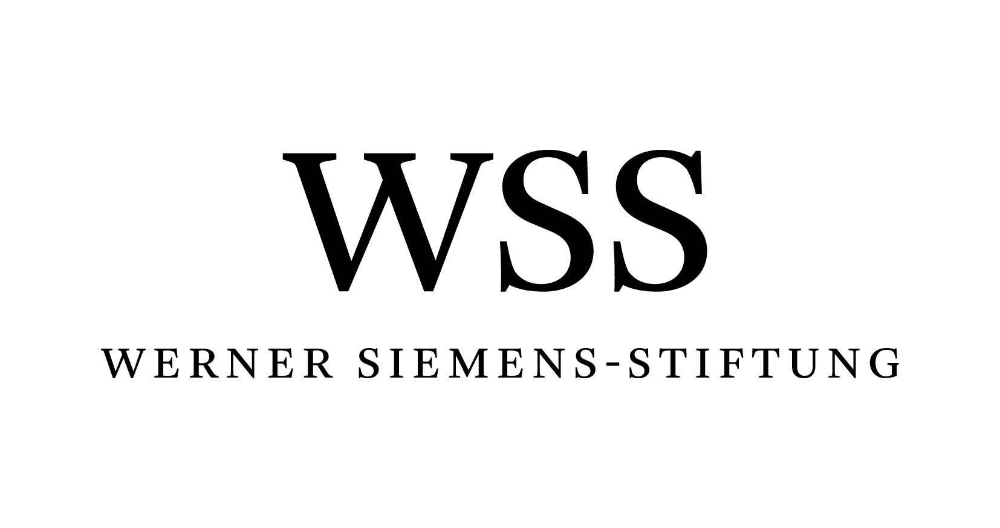
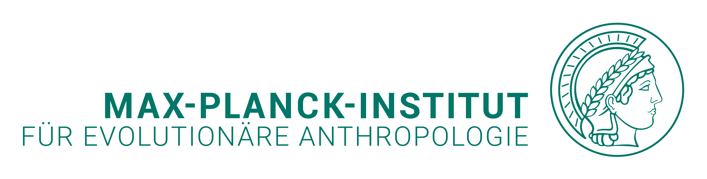

# Acknowledgements

We would like to thank

<!-- tabs:start -->

## **Financial Support**

<!-- 

	
	 
	This summer school is supported by the Werner Siemens-Stiftung (Grant: Paleobiotechnology, awarded
to Pierre Stallforth, Hans-Knöll Institute, and Christina Warinner, Max Planck Institute for Evolutionary Anthropology)

 -->

## **Institutional Support**

<!-- 

	
	
	
	

 -->

## **Infrastructural Support**

<!-- 

	
	 
	 
	The 2022 edition of work was supported by the BMBF-funded de.NBI Cloud within the German Network for Bioinformatics Infrastructure (de.NBI) (031A532B, 031A533A, 031A533B, 031A534A, 031A535A, 031A537A, 031A537B, 031A537C, 031A537D, 031A538A).

 -->

<!-- tabs:end -->
